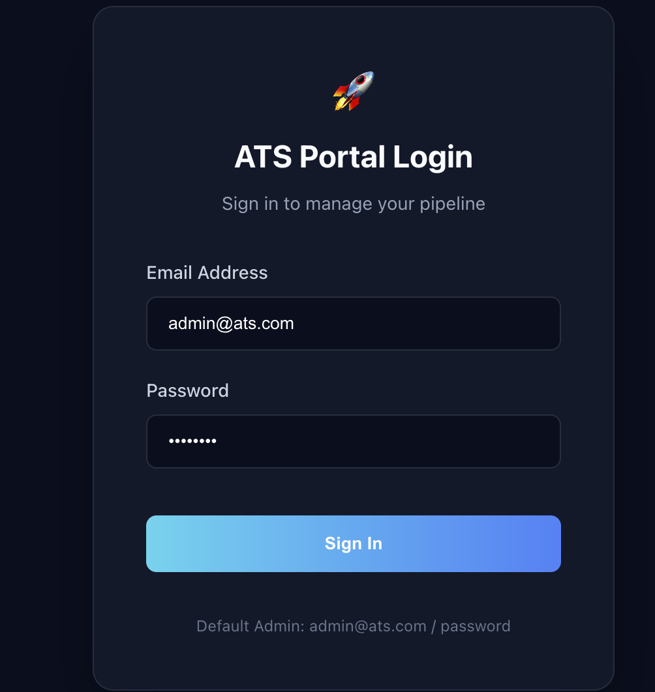
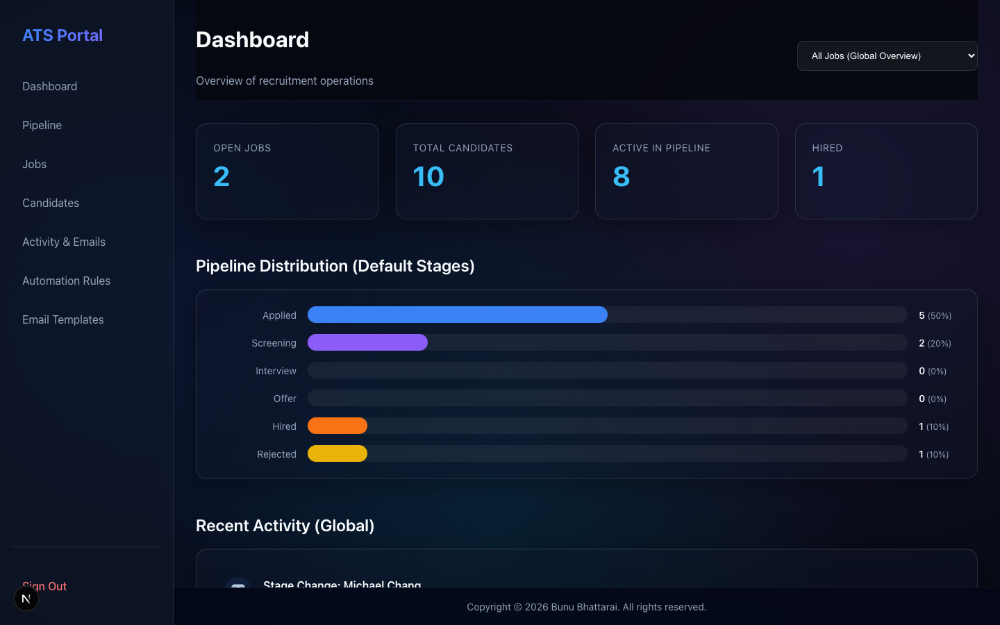
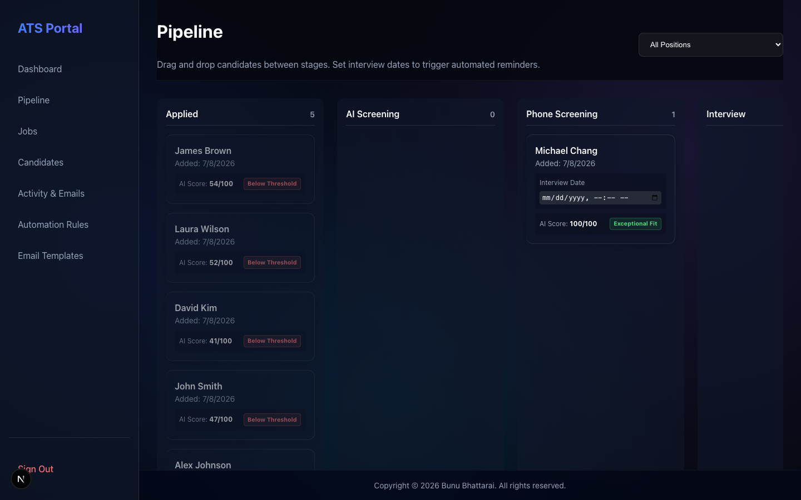
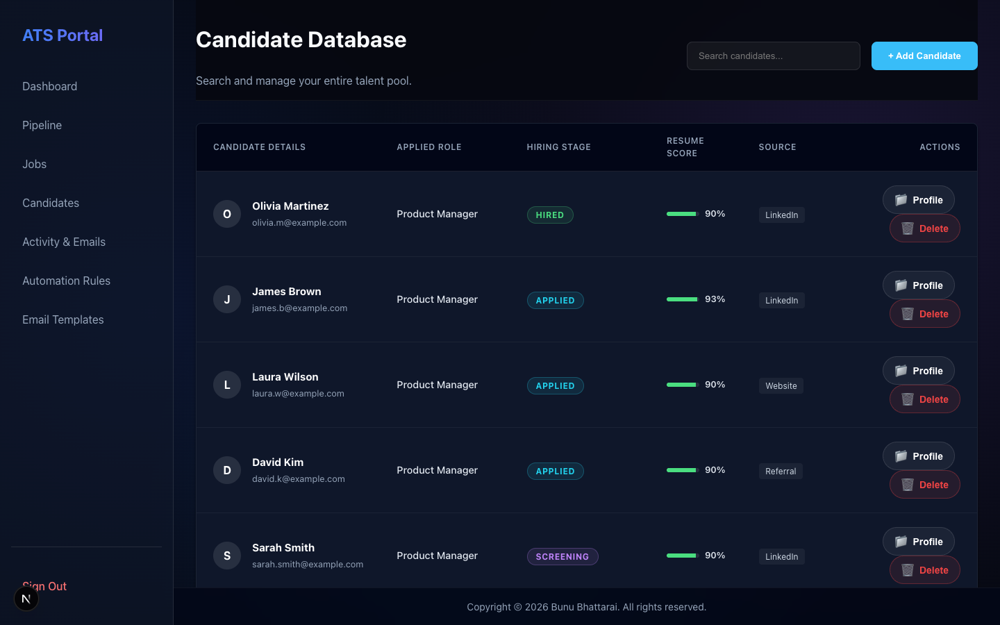
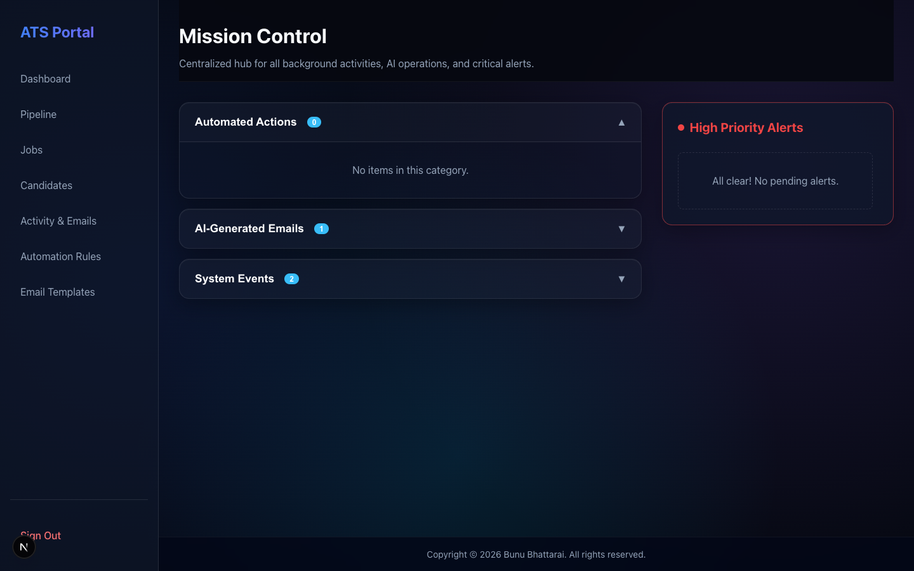
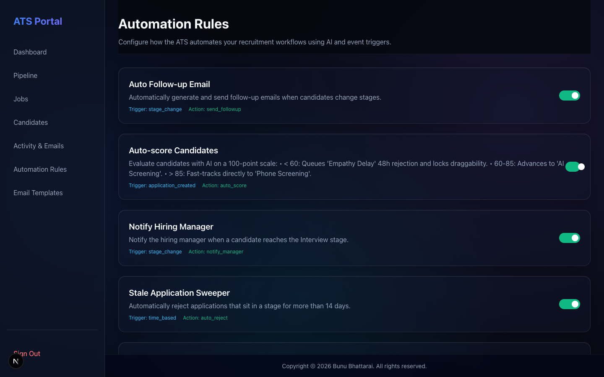
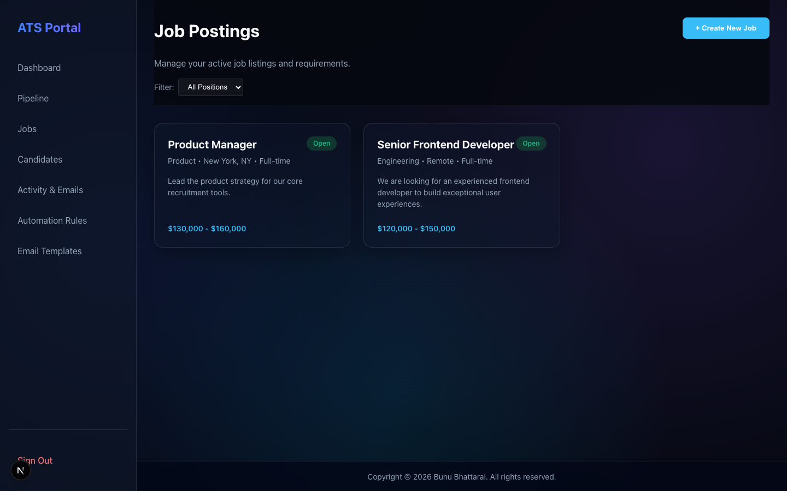
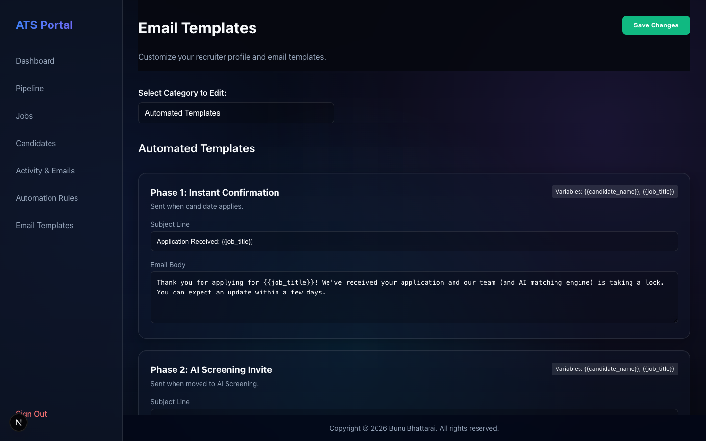
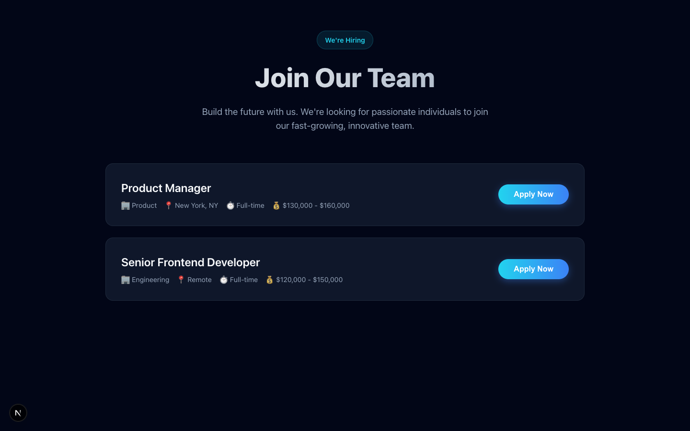
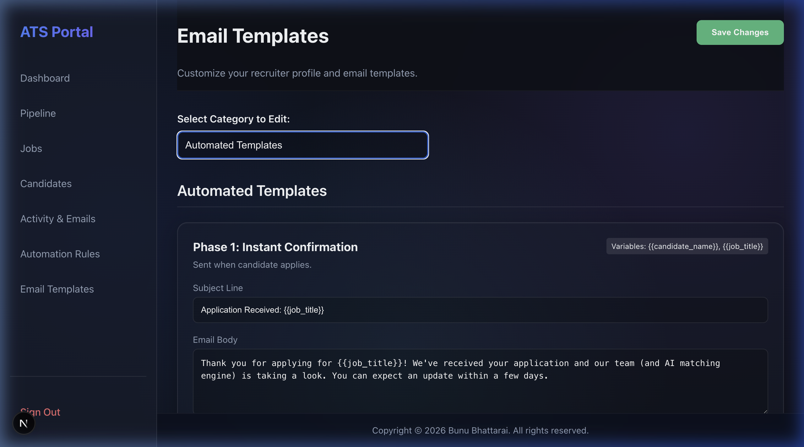

# UI Tour

Welcome to the visual tour of the Next-Gen Applicant Tracking System. Below are sample real screenshots of the platform's core features, showcasing the glassmorphic design system and the dynamic UI capabilities.

## 0. Login

Secure login interface protecting the recruiter dashboard.

## 1. Main Dashboard

The global overview dashboard providing high-level funnel metrics and recent pipeline activities.

## 2. Dynamic Pipeline (Kanban Board)

The heart of the ATS. This drag-and-drop Kanban board features color-coded AI Fit Badges and automatically evaluates pipeline rules (e.g. fast-tracking or delaying candidates) when a card is moved.

## 3. Candidate Command Center

The comprehensive database view of all talent. Features the "Magic Auto-Fill" capabilities and allows for granular manual overrides of the AI score.

## 4. Mission Control (Activity & Emails)

Replaces intrusive popup toasts with a dedicated log hub. It categorizes automated actions and intelligently bubbles up SLA breaches and Slack webhooks to the High Priority box.

## 5. Automation Rules

The configuration page where recruiters can toggle and manage the active background AI workflows.

## 6. Jobs List

The directory of open and closed requisitions, managing requirements and active postings.

## 7. Settings

Dynamic configuration for Email Templates and SLA definitions to power the background rules engine.

## 8. Public Careers Portal (Magic Resume Parse)

The candidate-facing application page featuring a dashed dropzone. Resumes dropped here are autonomously parsed by the AI to instantly auto-fill the application form, drastically reducing friction.

## 9. Email Templates (Configuration)

A detailed view of the 12 dynamic AI-powered email templates that automate candidate outreach at every stage of the pipeline.

